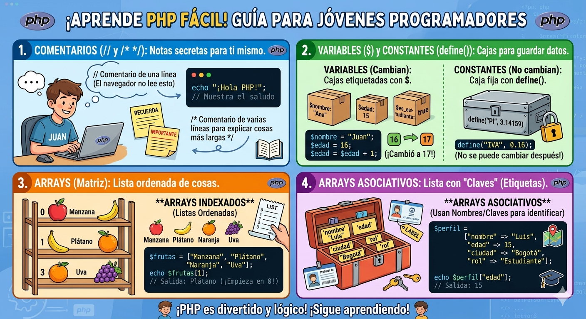

# intro_php

Son notas dentro del código que el servidor ignora por completo; sirven para explicar, documentar o aclarar qué hace el programa.

Una sola línea: Se usan dos barras // o una almohadilla #.

Varias líneas: Se encierran entre /* y */.

## Variables y Constantes
Ambas sirven para guardar información, pero funcionan de forma distinta:

Variables: Son "contenedores" para datos que pueden cambiar durante la ejecución.

Siempre empiezan con el signo de peso ($)seguidodelnombre(ejemplo:‘edad = 25;`).

## Constantes
Son valores fijos que NO pueden modificarse ni eliminarse una vez definidos. 
Se crean usando la función define() o la palabra clave const, y a diferencia de las variables, no llevan el signo $ antes de su nombre.

## Arrays y Arrays Asociativos
Un array permite almacenar múltiples valores en una sola variable, funcionando como una lista potente.

Arrays (Indexados): Los datos se organizan por posiciones numéricas (índices), que automáticamente empiezan desde el 0.
Por ejemplo, en una lista de frutas, la primera sería la posición 0, la segunda la 1, y así sucesivamente.

Arrays Asociativos: En lugar de usar números, utilizas nombres o "claves" personalizadas para guardar y encontrar los datos.

Se escriben en formato clave → valor (ejemplo: "nombre" => "Ana"). 

Son ideales cuando quieres asociar etiquetas con significado a los valores, como los detalles de un usuario.

# Operadores

# aritmeticos

Los operadores aritméticos son símbolos fundamentales en programación y matemáticas que permiten realizar cálculos básicos (suma +, resta -, multiplicación *, división /) sobre datos numéricos o variables. Generalmente incluyen operadores adicionales como el módulo % (resto de la división) y la potenciación, siguiendo reglas de precedencia (paréntesis, potencias, multiplicación/división, suma/resta). 

# asignacion

Los operadores de asignación en programación se utilizan para establecer o actualizar el valor almacenado en una variable, siendo el signo igual (=) el más fundamental. Además, existen operadores compuestos (como +=, -=, *=, /=) que combinan una operación aritmética con la asignación, permitiendo actualizar variables de forma concisa (ej. x += 5 es equivalente a x = x + 5).

# Comparacion

Los operadores de comparación son símbolos utilizados en programación y bases de datos para contrastar dos valores, devolviendo siempre un resultado booleano: verdadero (true) o falso (false). Permiten evaluar relaciones de igualdad, desigualdad y orden entre números, cadenas o variables, fundamentales para estructuras de control. 

# Logico

Los operadores lógicos son símbolos o palabras clave (como AND, OR, NOT) utilizados para combinar o modificar valores booleanos (true/falso, 1/0), permitiendo evaluar condiciones complejas en programación, bases de datos y matemáticas. Evalúan expresiones para retornar un resultado verdadero, falso o nulo. 

# Incremento y decremento

Los operadores de incremento (++) y decremento (--) son operadores unarios en programación que suman o restan 1 a una variable numérica, respectivamente. Son formas abreviadas de escribir x = x + 1 o x = x - 1, muy utilizados para bucles y contadores. 

